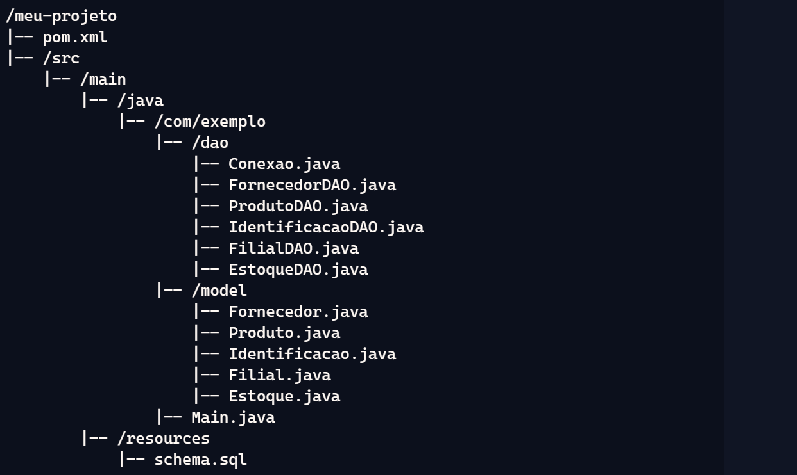
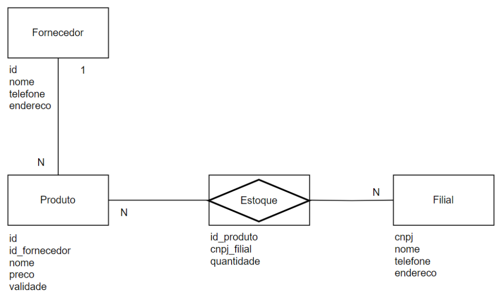
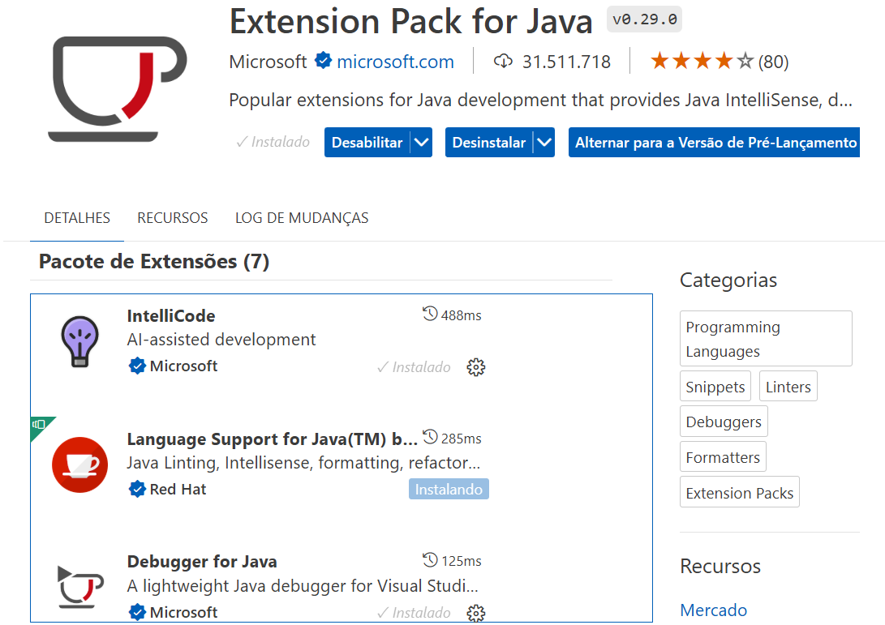

# java-sqlite-06-dao

Aplicação `Java` que segue o padrão _`Data Access Object`_ (`DAO`) para acessar um banco de dados `SQLite`. Estrutura do projeto com as tabelas: Fornecedor, Produto, Identificacao, Estoque e Filial.

# Passos para Criar o Projeto:
1) Estrutura do Projeto.

2) Configuração do arquivo `pom.xml`.

3) Criação das Entidades, _`Plain Old Java Object`_ (`POJOs`).

4) Criação dos `DAOs`.

5) Classe Principal (`Main.java`) para testar as operações.

6) Instalar _plugin_ para visualização do banco de dados _`SQLite`_.

# Estrutura do Projeto

# Diagrama de Entidades e Relacionamentos (DER)

# Extension Pack for Java
Instalar o _plugin_ `Extension Pack for Java`.
