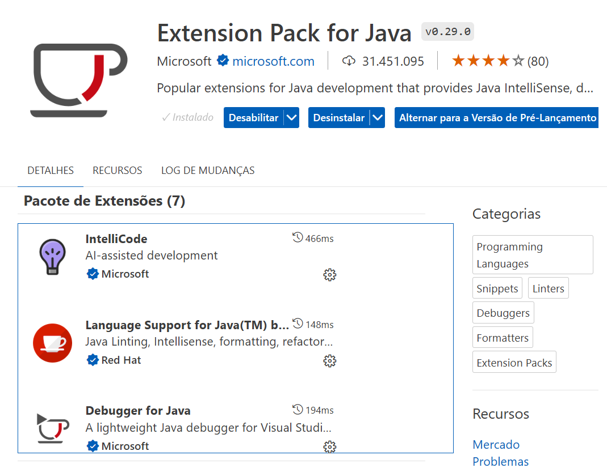

# java-sqlite-06-dao
Aplicação `Java` que segue o padrão _`Data Access Object`_ (`DAO`) para acessar um banco de dados `SQLite`. Tabelas: Fornecedor, Produto, Identificacao, Estoque e Filial.

## Diagrama de Entidades e Relacionamentos (DER)


## Passos para Criar o Projeto:
1) Criação do repositório no `GitHub`.

2) Instalação dos _plugin_ para algoritmos em Java e visualização do banco de dados _`SQLite`_.

3) Criação da estrutura do Projeto.

4) Criação do arquivo `pom.xml`.

5) Criação das Entidades, _`Plain Old Java Object`_ (`POJOs`).

6) Criação dos `DAOs`.

7) Classe Principal (`Main.java`) para testar as operações.

# Criação do Projeto:
1) Criar um repositório público para o projeto no `GitHub`. Ao criar o projeto, marcar as opções `Public` e `Add a README file`. No item `Add .gitignore`, selecionar a opção `Maven`. Em seguida, clicar no botão `Code` e iniciar um `Codespace` clicando em `Create a codespace on main`.

2) No `Codespace`, instalar a extensão (_plugin_) VS Code `Extension Pack for Java`:


3) No `Codespace`, instalar a extensão (_plugin_) VS Code `SQLite Viewer for VS Code`:


## Estrutura do Projeto


4) No `Codespace`, criar a estrura básica de diretório do projeto:
```
  src/main/java
```

5) No `Codespace`, criar as pastas:
```
  src/main/java/com/exemplo
```

```
  src/main/java/com/exemplo/model
```

```
  src/main/java/com/exemplo/dao
```

6) Criar o arquivo `pom.xml`.
```xml
<project xmlns="http://maven.apache.org/POM/4.0.0" xmlns:xsi="http://www.w3.org/2001/XMLSchema-instance" xsi:schemaLocation="http://maven.apache.org/POM/4.0.0 http://maven.apache.org/xsd/maven-4.0.0.xsd">
    <modelVersion>4.0.0</modelVersion>

    <groupId>com.exemplo</groupId>
    <artifactId>meu-projeto</artifactId>
    <version>1.0-SNAPSHOT</version>

    <properties>
        <maven.compiler.source>15</maven.compiler.source>
        <maven.compiler.target>15</maven.compiler.target>
    </properties>

    <dependencies>
        <dependency>
            <groupId>org.xerial</groupId>
            <artifactId>sqlite-jdbc</artifactId>
            <version>3.34.0</version>
        </dependency>
    </dependencies>

    <build>
        <plugins>
            <plugin>
                <groupId>org.apache.maven.plugins</groupId>
                <artifactId>maven-compiler-plugin</artifactId>
                <version>3.8.1</version>
                <configuration>
                    <source>15</source>
                    <target>15</target>
                </configuration>
            </plugin>
            <plugin>
                <groupId>org.codehaus.mojo</groupId>
                <artifactId>exec-maven-plugin</artifactId>
                <version>1.6.0</version>
                <executions>
                    <execution>
                        <goals>
                            <goal>java</goal>
                        </goals>
                    </execution>
                </executions>
                <configuration>
                    <mainClass>com.exemplo.Main</mainClass>
                </configuration>
            </plugin>
        </plugins>
    </build>
</project>
```

5) Criar das Entidades, _`Plain Old Java Object`_ (`POJOs`), na pasta `src/main/java/com/exemplo/model`:

`Fornecedor.java`, `Produto.java`, `Identificacao.java`, `Filial.java` e `Estoque.java`.

6) Criar as classes dos _`Data Access Objects`_ (`DAOs`) na pasta `src/main/java/com/exemplo/dao`:

`FornecedorDAO.java`, `ProdutoDAO.java`, `IdentificacaoDAO.java`, `FilialDAO.java` e `EstoqueDAO.java`.

7) Criar a classe Principal `Main.java` na pasta `src/main/java/com/exemplo`, para testar as operações.
